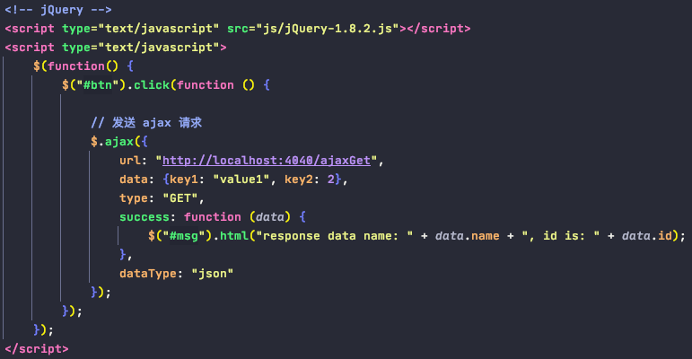
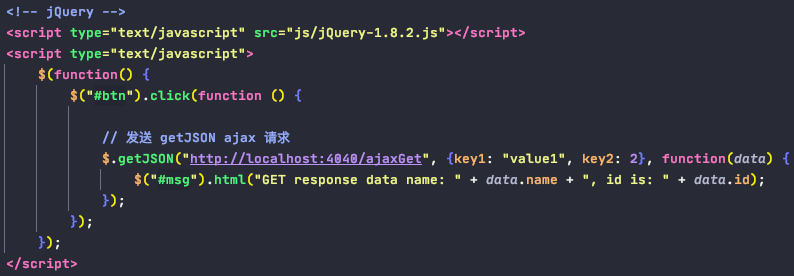

# Ajax

0. 定义: 
    
        - AJAX: Asynchronous Javascript And Xml (异步JavaScript和XML)
        - 本质: 浏览器通过js异步发起请求, 局部更新页面的技术
                a. 异步: 不用等收到服务器返回的response, 直接执行下面的代码, 用户体验友好
                b. 局部更新: URL地址栏没有发生变化, 局部更新不会舍弃原来页面的内容, 只有指定的地方数据更新
        

1. 原生js发送Ajax -- rarely use

2. jQuery发送Ajax

        常用:
        $.ajax方法
            url         请求地址
            type        请求类型, GET/POST
            data        请求数据
                        格式:
                            a. name=value&name=value
                            b. {key: value}
            success     成功响应的回调函数
            dataType    响应的数据类型
            
            
        a. 发送普通ajax请求

       b. 发送get/post ajax请求, 省略type参数

       c. 发送getJSON ajax请求, 省略type参数和返回值类型参数

