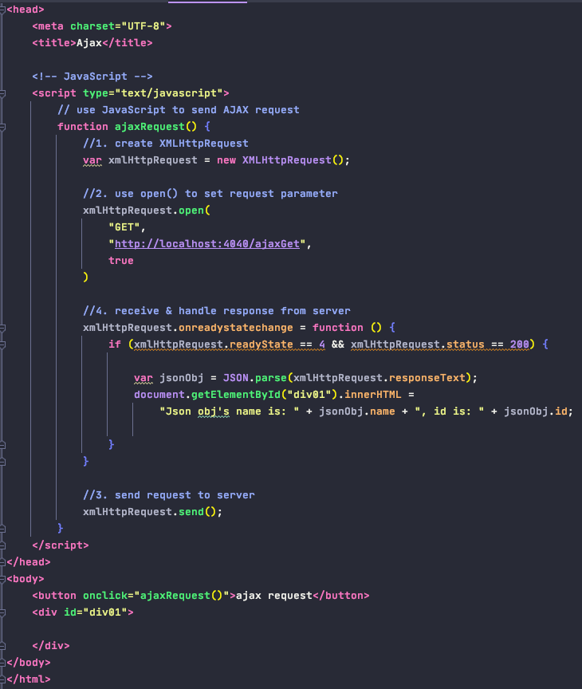

# Ajax

0. 定义: 
    
        - AJAX: Asynchronous Javascript And Xml (异步JavaScript和XML)
        - 本质: 浏览器通过js异步发起请求, 局部更新页面的技术
                a. 异步: 不用等收到服务器返回的response, 直接执行下面的代码, 用户体验友好
                b. 局部更新: URL地址栏没有发生变化, 局部更新不会舍弃原来页面的内容, 只有指定的地方数据更新
        

1. 原生js发送Ajax

