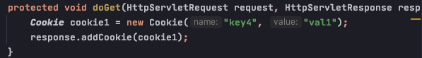
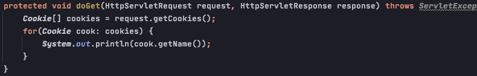
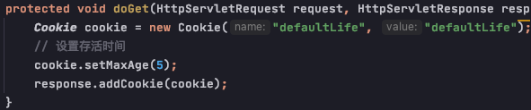

# Cookie

### Definition:
    - 是服务器通知客户端保存键值对的一种技术
    - 是servlet发送到web浏览器的少量信息，这些信息由浏览器保存，之后每次请求都会带着cookie发送给服务器。cookie的值可以唯一地标识客户端，因此 cookie 常用于会话管理
    - 每个cookie的大小限定为4KB

### 创建 cookie

    - Cookie class only has one construcor ==> Cookie(key, value)

### 获取 cookie from request header

### 设置 cookie 存活时间

    - 正数: 表示在指定的秒数后过期
    - 负数: 表示浏览器一关，cookie就会被删除 (默认值是 -1)

### cookie的应用: 
    - 实现免用户名登录 (即在cookie的有效期内，第二次或第n次登录某页面时，自动展示用户名信息 (从浏览器request header的cookie中获取)，只需填写passowrd信息)
