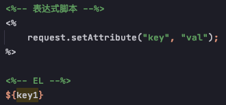

# EL (expression language)

### Definition
    - EL 表达式主要是代替jsp页面中的表达式脚本(expression)在jsp页面中进行数据的输出
    - EL 表达式在数据输出时，比jsp的表达式脚本要间接很多
    - EL 表达式在输出 null时输出的是空串。jsp表达式脚本输出null值得时候，输出的是null字符串

    

### EL 表达式搜索与数据的顺序
    - 当四个域中都有相同的key的数据时，EL表达式会按照四个域的从小到大的顺序去进行搜索，找到就会输出
        1) pageContext
        2) request
        3) session
        4) application

