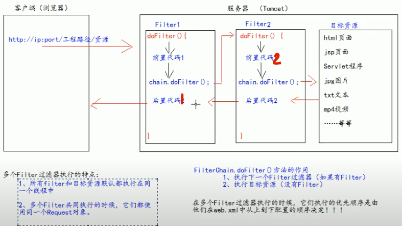

# Filter

### Definition:
    - Java Web 三大组件之一: listener, filter, servlet
    - 用途: 拦截请求，过滤响应 (rare)

### 拦截请求
    - 权限检查
    - 日志操作
    - 事务管理
    ...
    

### 多个过滤器的工作原理 & 执行顺序

    - doFilter() 方法做的两件事: 1.执行下一个filter, 2. 执行目标资源的获取
    - 执行顺序是根据在 web.xml 中 filter 的配置决定的
    - 多个filter 共享同一个 request 且都执行在同一个线程中

