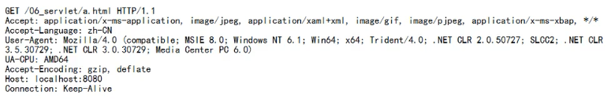
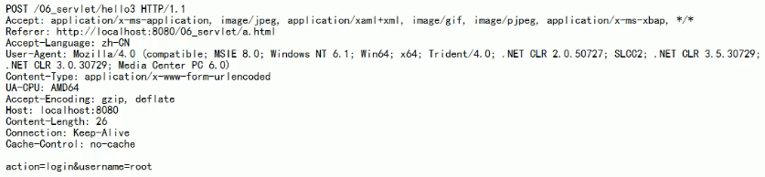
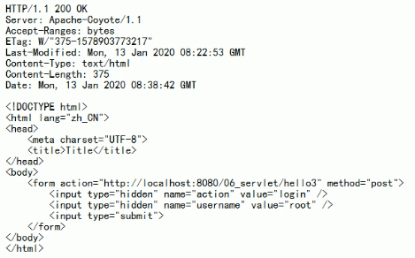

# HTTP

## Definition: 
    - 协议: 双方或多方相互约定好，大家都需要遵守的规则，叫协议
    - Http 协议: 指客户端和服务器之间通信时，发送的数据，需要遵守的规则，叫 HTTP 协议
    - Http 协议中的数据又叫 报文
    - 请求: 客户端给服务器端发送数据；响应: 服务器给客户端回传数据
    
    
##  Request

### Get 请求

    - 请求行
        1) 请求的方式 GET
        2) 请求的资源路径 + ？ 请求参数
        3）请求协议的版本号  HTTP/1.1
        
    - 请求头  (key: value 组成  不同键值对表示不同含义)
        Accept: 告诉服务器，客户端可以接收的数据类型
        Accept-Language: 告诉服务器，客户端可以接收的语言类型 zh-CN, en_US
        User-Agent: 浏览器的信息
        Accept-Encoding: 告诉服务器，客户端可以接收的编码 (压缩) 格式
        Host: 告诉服务器，localhost: 8080, 表示请求时服务器的ip和端口号
        Connection: 告诉服务器，当前连接如何处理 
            Keep-Alive (告诉服务器，回传数据后不要马上关闭，保持一小段时间的连接）
            Closed (马上关闭)

### Get 请求有哪些

    1) form 标签 method=get
    2) a 标签
    3) 在浏览器地址栏中输入地址后敲回车
    4) link 标签引入 js 文件  ？？？
    5) script 标签引入 js 文件 ？？？
    6) img 标签引入图片 ？？？
    7) iframe 引入 html 页面 ？？？
    

### Post 请求

    - 请求行
        1) 请求的方式 POST
        2) 请求的资源路径 + ？ 请求参数
        3）请求协议的版本号  HTTP/1.1
        
    - 请求头
        Referer: http://localhost:8080/06_servlet/a.html   表示请求发起时，浏览器地址栏中的地址
        Content-Type: 表示发送的数据类型
                - application/x-www-form-urlencoded
                  (表示提交的数据格式是: name=value&name=value, 然后对其进行 url 编码,
                  url 编码是指把非英文内容转换为: %xx%xx)
                  
                - multipart/form-data (表示以多段的形式提交数据给服务器, 以流的形式提交，用于上传)
        Content-Length: 发送的数据的长度 (request body) 
        
        (空行)
    - 请求体  (发送给服务器的数据)

### Post 请求有哪些

    1) form 标签 method=post

## Response

### 响应

    - 响应行
        1) 响应的协议和版本号  HTTP/1.1
        2) 响应状态码        200
        3) 响应状态描述符     ok
        
    - 响应头 (key-value pair)
        Server: 表示服务器的信息
        Content-Type: 表示响应体的数据类型 eg: text/html
        Content-Length: 响应数据的长度
        Date: 响应的时间 (格林时间)
    
        (空行)
        
    - 响应体  (回传给客户端的数据)

### 响应码
    - 200       表示请求成功
    - 302       表示请求重定向
    - 404       表示请求服务器已经收到了，但是你要的数据不存在 (一般是请求地址有误)
    - 500       表示请求服务器已经收到了，但是服务器内部代码错误
    
    
    
### MIME 类型说明 ( response data type )
    - HTTP 协议中的数据类型 (Multipurpose Internet Mail Extensions - 多功能 Internet 邮件扩充服务)
    - 类型格式: 大类型 / 小类型， 并与某一种文件的扩展名相对应
    - 常见 MIME 类型：
    
            text/html
            text/plain
            image/gif
            image/jpeg
            video/mpeg
            application/x-gzip
            application/x-tar
            ...
    
