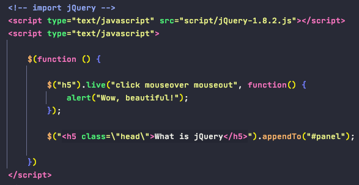

# jQuery

1. Definition:
        
        - jQuery = JavaScript + Query, 即辅助JavaScript开发的js类库
        - 核心: write less, do more
        - $()是jQuery的核心函数
        - jQuery对象的本质是DOM对象数组 + jQuery提供的一系列功能函数
        - jQuery对象不能使用DOM对象的属性和方法; DOM对象也不能使用jQuery对象的属性和方法
        - DOM对象与jQuery对象之间相互转换

               
               
2. $( ) 核心函数

        - $(function() {..}) 代表页面加载完之后自动调用
        - $(DOM_ele) 返回一个jQury对象
        - jQuery选择器选择页面元素
              a. 基本选择器: 
                - $("tag_name")
                - $("#element_id")
                - $(".class")
                - $("*") 选择所有元素
                - $(selector_01, selector_02) 组合选择器, 合并多个选择器选择的结果一并返回, 返回的DOM元素集是按其在页面的顺序排序
                
              b. 高级选择器: 查文档
                
        - $("HTML tag").appendTo("body") 代表向html页面添加HTML元素
        

3. jQuery定位/操作标签的函数

        0). 标签的定位: 各种标签选择器
    

        1). 操作标签内容/文本/value
    
            - html(): 获取或设置start标签和end标签内的内容(包括标签或文本)
    .png)
            
            - text(): 获取或设置start标签和end标签内的文本
    .png)
            
            - val(): 获取或设置表单项的value属性值
    .png)
    
    
        2). 操作标签属性

            - attr(): 获取或设置属性值, 但不推荐使用在checked, readOnly, selected, disabled等, 因为如果不设置会返回undefined
    .png)
                
            attr()还可以添加自定义标签属性
    
            
           - prop(): 获取或设置属性值, 推荐使用, 尤其在需要checked, readOnly, selected, disabled时推荐使用, 但不能设置自定义标签属性
    .png)

        3). 操作标签的增删改
            
            增: 
               - a.append(b)            a的子元素的最后插入b
               - a.prepend(b)           a的子元素的最前插入b
               - a.insertAfter(b)       ba
               - a.insertBefore(b)      ab
            
            改:
               - a.replaceWith(b)       用b替换a
               - a.replaceAll(b)        用a替换掉所有b
            
            删:
               - a.remove()             删除a标签
               - a.empty()              清空a标签的内容
               
               
4.  jQuery事件

        0). 原生js页面加载 vs jQuery页面加载 (faster)
            
            加载触发时间:
                - jQuery的页面加载是在浏览器内核解析完页面的标签并创建好DOM对象之后就会马上执行
                - 原生js的页面加载, 除了要等浏览器内核解析完页面的标签创建好DOM对象, 还要等标签显示所需要的内容加载完之后才会执行
                
            执行的次数:
            
                - jQuery的页面加载是把全部注册的function函数按顺序依次执行
                - 原生js的页面加载是执行最后一个注册的函数
                

        1). 常用的事件处理函数
        
            - click()

            - mouseover(): 略
            - mouseout(): 略
            - mousemove(): 略
            - bind(): 一次可以同时绑定一个或多个事件

            - one(): 也可以同时绑定一个或多个事件, 但每个事件只响应一次

    
            - live(): 也是用来绑定一个或多个事件, 并且对jQuery动态创建出来的标签也依然有效

        2). 获取事件对象, 将event参数传入到回调函数中, 常用来判断事件类型: event.type

