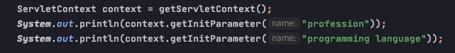

# Servlet

### Key Points
    - Servlet (life-cycle & overrite原理)
    - servletConfig
    - servletContext

## Definition
    - servlet 是 JavaEE 规范之一，规范就是接口 (interface)
    - servlet 是 JavaWeb 三大组件之一，三大组件分别是: servlet, filter, listener
    - servlet 是 运行在服务器上的 Java 小程序，它可以接收客户端发送过来的请求，并响应数据给客户端
    

## Life Cycle & overrite doGet() 和 doPost() 的原理
    1) servlet 构造器 -- 创建 servlet 的时候被调用 only once
    2) init() -- 创建 servlet 的时候被调用 only once
    3) service() -- 每次访问servlet都会调用 every time
        - doGet() -- 如果请求是 get 请求，会调用 service() 方法中的 doGet()
        - doPost() -- 如果请求是 post 请求，会调用 service() 方法中的 doPost()
    4) destroy() -- 工程停止的时候被调用 

## ServletConfig
    - 每个 servlet 都对应一个servletConfig
    - 用于获取专属于每个 servelt 自己的 init-param 键值对

## ServletContext

### 域对象？
    - 可以像 Map 一样存取数据的对象 就叫 域对象
    - 这里的 域 指的是存取数据的操作范围
    
            存数据               取数据                删除数据
    Map     put()               get()               remove()
    域对象   setAttribute()   getAttribute()      removeAttribute()

### Definition
    - ServletContext 是一个接口，用来表示 Servlet 上下文对象
    - 一个 web 工程只有一个 ServletContext 对象实例
    - ServletContext 对象是一个域对象

### 4个作用
    1) 获取 web.xml 中配置的上下文参数 context-param (整个工程可见，即所有 servlet 都可见)
    
        web.xml中声明 context-param

        
        通过 servletContext 获取 web.xml 中声明的 context-param 参数

        
        
    2) 获取当前的工程路径，格式: /工程路径
    3) 获取工程部署后在服务器硬盘上的绝对路径
    4) 像 Map 一样存取数据

