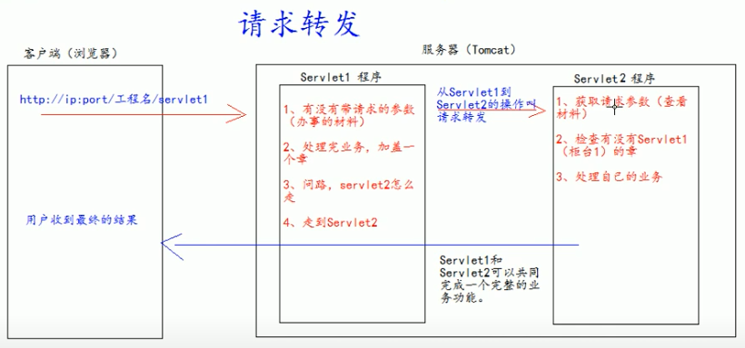
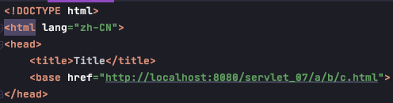
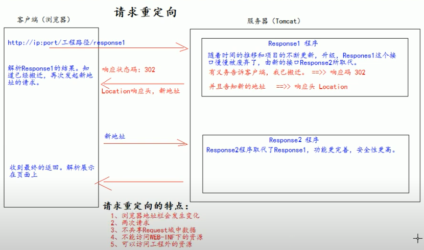
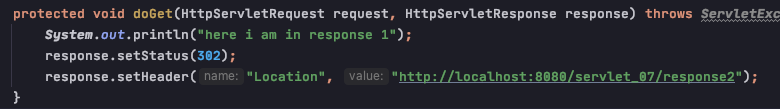
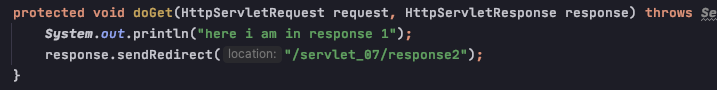

# HttpServlet

## HttpServletRequest

### 常用 API

    - getRequestURI(): 获取工程资源路径 
    
    

    - getRequestURL(): 获取工程路资源全限定路径 (服务器中)
    
    

    - getRemoteHost: 获取客户端ip
    - getHeader(str): 获取 请求头 信息
    - getParameter(str): 获取参数
    - getParameterValues(str): 获取参数(含有多值, eg: checkbox)
    - getMethod(): 获取 http 方法， GET or POST
    - setCharacterEncoding("UTF-8")
    - setAttribute(key, value)
    - getAttribute(key)
    - getRequestDispatcher: 获取转发对象
    

### 请求转发

    - Definition: 服务器收到请求后，从一次资源跳转到另一个资源的操作叫做请求转发
    - 浏览器地址栏没有变化，相当于只有一次请求，尽管访问了多个资源
    - 共享 request 域中的数据
    - 可以转发到 WEB-INF 目录下
    - 不能访问工程之外的资源

### base 标签

    - 所有相对路径在工作时都会参照当前浏览器地址栏中的地址进行跳转，<a> ok，但请求转发由于 url 不变，会使得相对路径工作时报错
    - 因此使用 <base> 标签设置页面相对路径工作时参照的地址，而忽略浏览器当前的地址; href 属性为全限定路径名

### web 中 "/" 斜杠的不同意义

    1) "/" 是一种绝对路径
    2) "/" 斜杠如果被浏览器解析，得到的地址是: http://ip:port/
        - <a href="/">斜杠</a>
    3) "/" 斜杠如果被服务器解析，得到的地址是: http://ip:port/工程路径
        - <url-pattern>/servlet1</url-pattern>
        - servletContext.getRealPath("/")
        - request.getRequestDispatcher("/")
    
    特殊情况: response.sendRedirect("/"); 重定向把斜杠发送给浏览器解析，得到 http://ip:port/

  

## HttpServletResponse

### 设置浏览器和服务器使用的编码都是UTF-8
    - response.setContentType("UTF-8") 
    - response.setHeader("Content-Type","text/html;charset=UTF-8")
     

### 两个输出流的说明
    - 字节流   getOutputStream() -- 常用于下载(传递二进制数据)
    - 字符流   getWriter() -- 常用于回传字符串 (常用) 
    
    两个流只能同时使用一个。
    使用了字节流，就不能再使用字符流，反之亦然，否则就会报错。
    
    
    
### 请求重定向

    - Definition: 客户端给服务器发请求，然后服务器告诉客户端说，我给你一些地址，你去新地址访问，这叫作请求重定向 (因为之前的地址已经被废弃)。
    - 浏览器地址栏会发生变化
    - 两次数据请求
    - 不共享 request 里的数据，因为重定向的 request 已经是第二个 request 了
    - 不能访问 WEB-INF 目录下的资源， 因为使用的是 url link，是给浏览器解析的，不是服务器，相当于 <a>
    - 可以访问工程外资源，因为"/"根路径不包含工程路径，eg: http:twitter.com

### Redirect 的两种写法

写法一：

写法二: 

