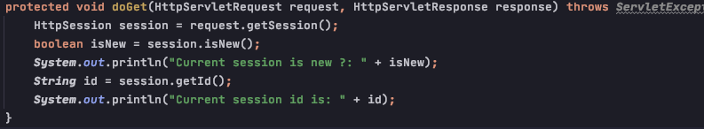
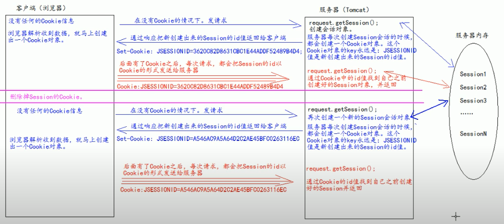

# Session

### Definition
    - session 是一个接口 (HttpSession)
    - session 是用来维护一个客户端和服务器之间关联的一种技术
    - session 是在server-side
    - session timeout: 客户端两次向服务器发起请求之间的间隔
    
    
    
### 创建或获取 session

### 向session中存取数据

[setGetValueInSession](imagePool/setGetValueInSession.png)

### 设置/获取session timeout
    
    设置session timeout: 
        - 在web.xml 中设置web project scope session timeout 
[setProjectScopeSessionTimout](imagePool/setProjectScopeSessionTimout.png)    

        - 设置某个session的timeout
[setSingleSessionTimeout](imagePool/setSingleSessionTimeout.png)        

    获取session timeout：
[getSessionTimeout](imagePool/getSessionTimeout.png)

### destroy session

[destroySession](imagePool/destroySession.png)

### Cookie 和 Session之间的技术内幕
    - request.getSession() 是通过获取request header里cookie的JSESSIONID (即session id) 来判断
    是否应当创建session的；如果cookie 中有 JSESSIONID，就去内存直接调；如果没有了，就创建一个新的session,
    存在内存，并把新session 的session id 通过response header的形式返回给浏览器，浏览器用这个response header 
    的 session id 来创建cookie 中的JSESSIONID, 为下次访问使用

